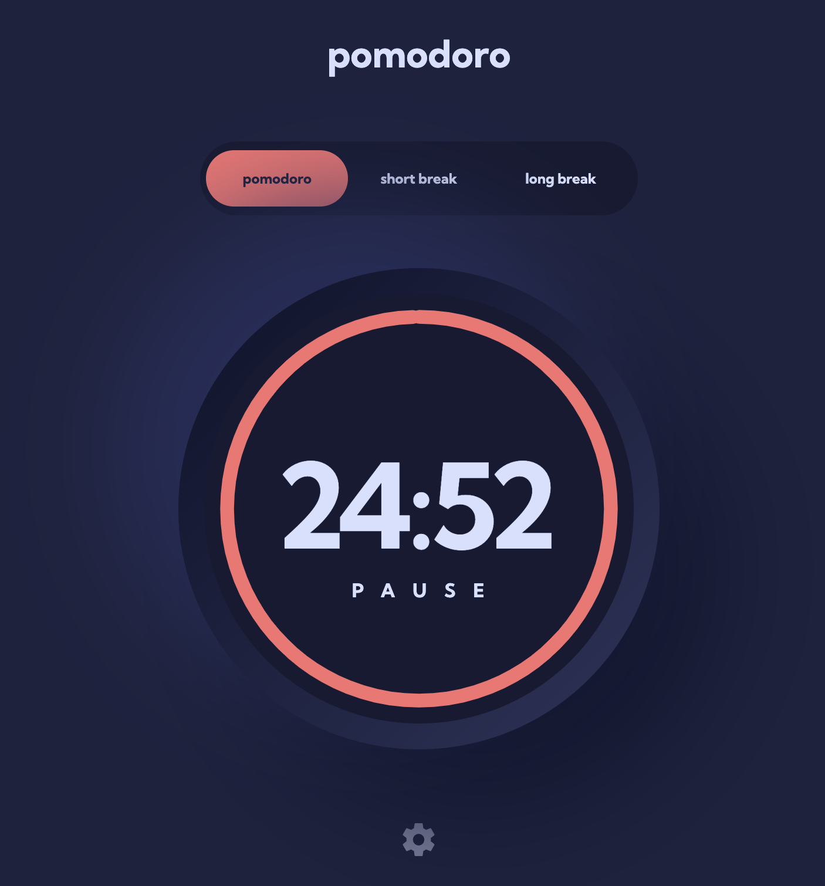

# Frontend Mentor - Pomodoro app solution

This is a solution to the [Pomodoro app challenge on Frontend Mentor](https://www.frontendmentor.io/challenges/pomodoro-app-KBFnycJ6G). Frontend Mentor challenges help you improve your coding skills by building realistic projects.

## Table of contents

- [Overview](#overview)
  - [The challenge](#the-challenge)
  - [Screenshot](#screenshot)
  - [Links](#links)
- [My process](#my-process)
  - [Built with](#built-with)
  - [What I learned](#what-i-learned)
  - [Continued development](#continued-development)
- [Author](#author)
- [Acknowledgments](#acknowledgments)

## Overview

A simple Pomodoro timer application, that lets you change the font and colors. You can set the timer to pomodoro mode, sort break, and long break. The duration of these intervals is adjustable in the settings menu. You can pause the timer or resume from being paused by clicking on the timer.

### The challenge

Users should be able to:

- Set a pomodoro timer and short & long break timers
- Customize how long each timer runs for
- Pause and resume the timer
- See a circular progress bar that updates every minute (I did every second) and represents how far through their timer they are
- Customize the appearance of the app with the ability to set preferences for colors and fonts

### Screenshot

### Links

- Solution URL: [Add solution URL here](https://your-solution-url.com)
- Live Site URL: [Add live site URL here](https://your-live-site-url.com)

## My process

### Built with

- Semantic HTML5 markup
- SCSS
- Flexbox
- Mobile-first workflow
- [Vanilla JS](http://vanilla-js.com/)

### What I learned

Usually everything in UI is a box, until it isn't. So I had to make use a SVG for the timer itself. Again, I tackled this with a minimalist approach using Vanilla JS only. I think vanilla JS was the right choice for this simple small project.

### Continued development

If I wanted to continue developing this thing I would add some kind of at minimum browser storage to track your usage of the app. It would be rewarding to earn tomatos for each pomodoro interval you complete.

## Author -- Kevin Mason

- Linkedin - [@Kevin Mason](https://www.linkedin.com/in/kevin-mason-7b83b3228/)
- Frontend Mentor - [@mrfinesse47](https://www.frontendmentor.io/profile/mrfinesse47)
- Github - [@mrfinesse47](https://github.com/mrfinesse47/)
- Lichess - [@mrfinesse47](https://lichess.org/@/mrfinesse47)

## Acknowledgments

As Always i'd like to thank the entire community of developers out there sharing their knowledge everywhere across the web.
